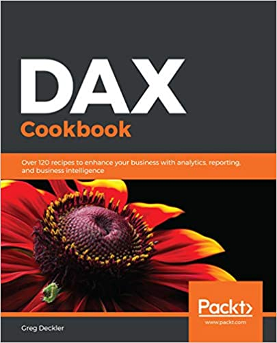

# DAX Cookbook
[DAX Cookbook](https://www.packtpub.com/data/learn-power-bi), published by [Packt](https://www.packtpub.com/) 

## Learn 
<ul><li>Understand how to create common calculations for dates, time, and duration</li>
<li>Create key performance indicators (KPIs) and other business calculations</li>
<li>Develop general DAX calculations that deal with text and numbers</li>
<li>Discover new ideas and time-saving techniques for better calculations and models</li>
<li>Perform advanced DAX calculations for solving statistical measures and other mathematical formulas</li>
<li>Handle errors in DAX and learn how to debug DAX calculations</li>
<li>Understand how to optimize your data models</li></ul>

## About 

DAX provides an extra edge by extracting key information from the data that is already present in your model. Filled with examples of practical, real-world calculations geared toward business metrics and key performance indicators, this cookbook features solutions that you can apply for your own business analysis needs.

You'll learn to write various DAX expressions and functions to understand how DAX queries work. The book also covers sections on dates, time, and duration to help you deal with working days, time zones, and shifts. You'll then discover how to manipulate text and numbers to create dynamic titles and ranks, and deal with measure totals. Later, you'll explore common business metrics for finance, customers, employees, and projects. The book will also show you how to implement common industry metrics such as days of supply, mean time between failure, order cycle time and overall equipment effectiveness. In the concluding chapters, you'll learn to apply statistical formulas for covariance, kurtosis, and skewness. Finally, you'll explore advanced DAX patterns for interpolation, inverse aggregators, inverse slicers, and even forecasting with a deseasonalized correlation coefficient.

By the end of this book, you'll have the skills you need to use DAX's functionality and flexibility in business intelligence and data analytics.

